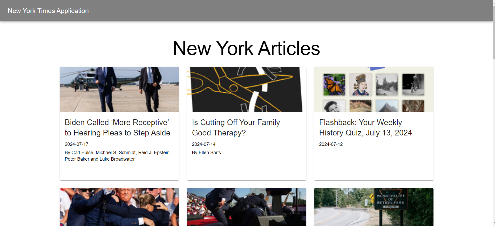
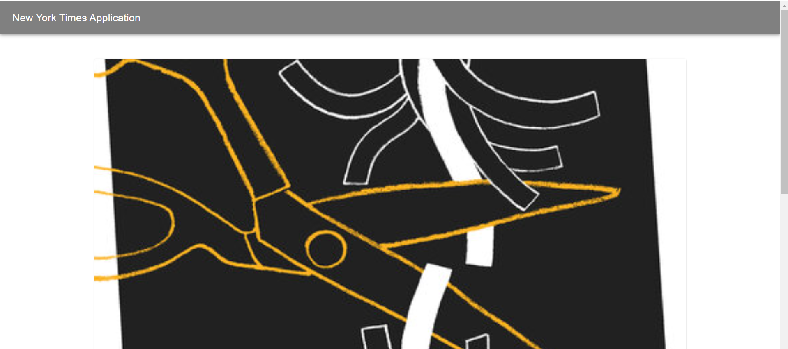

## New York Times Application

### Overview

This initiative is a web application that retrieves and showcases articles from the New York Times Most Popular API. Users can explore trending articles and access detailed information about each one.

The following routes/pages are included in this application:

1. Articles Listing Page - This page will retrieve the most popular articles from the New York Times API and display them using a grid layout.
2. Description Page - This page will show the details of the chosen article.

### Snapshots

1. Articles Listing Page
   

1. Article Description Page
   

### Setup Guide

1. Clone the repository:
   ```
   git clone <repository-url>
   ```
2. Change directory to the newly cloned folder:
   ```
   cd ny-times
   ```
3. Install dependencies:

   ```
   npm install
   ```

   OR

   ```
   yarn
   ```

### Operation

To start the development server, run:

```
npm run start
```

OR

```
yarn start
```

The application will run default in Port 3000. Access it via web browser at http://localhost:3000

### Technology stack

- `React v18.3`
- `React Router v6`
- `SWR`
- `ESlint` for linting
- `Prettier` for code formatting
- `SonarQube` for code anaylsis
- `Material UI v5`
- `React testing library`
- `Jest`
- `Cypress`

### Scripts

- `start`: Start the development server.
- `build`: Build the application for production.
- `test`: Run tests using Jest.
- `coverage`: Run tests with coverage report.
- `eject`: Eject the application from Create React App.
- `cypress`: Executes Cypress E2E tests
